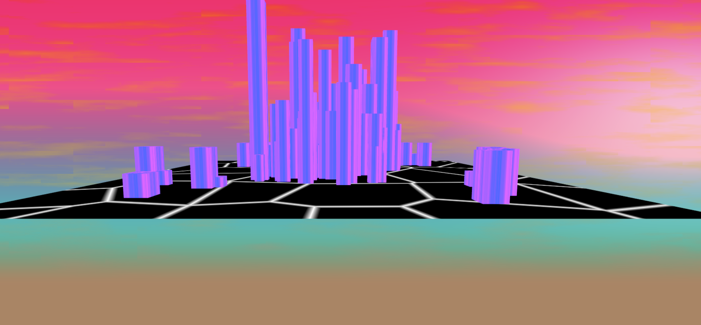
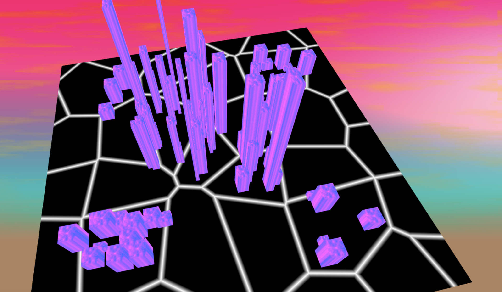
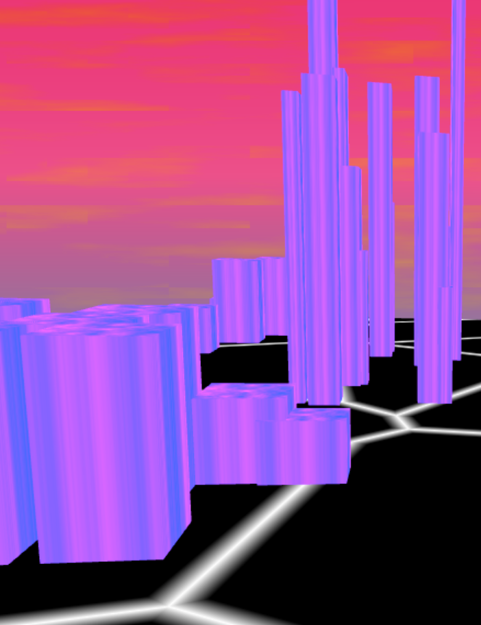

# hw06-city-generation

Wendy Sun

wentings

Project Demo: Somehow I have some problems with building so the demo link doesn't work

Features:

Since I didn't complete the last homework, I have to improv some of the features. I wasn't able to transform the roads into a 3d model.
Instead, I created a Voronoi grid to place the buildings. I created a constraint where the center of the grid is the most populated,
therefore the buildings rendered are mostly skyscrapers, where the buildings rendered in the outskirts are mostly smaller, 
wider houses. I then created randomly generated points that fall within the constraints of the voronoi grid, and using instance render
to create the buildings. I wasn't able to really successfully create a lambert shaded building texture, but I was able to create
an 80's inspired building texture, as well as a sky that aesthetically fits in with the buildings.

Renders:

Different Building Shapes:

Both the direction of growth and building placement and height are driven by the population density distribution:

Resources:
1. I used the same procedural sky generation as Homework 3 and 4
2. I used the voronoi grid from this shadertoy demonstration https://www.shadertoy.com/view/ldl3W8
